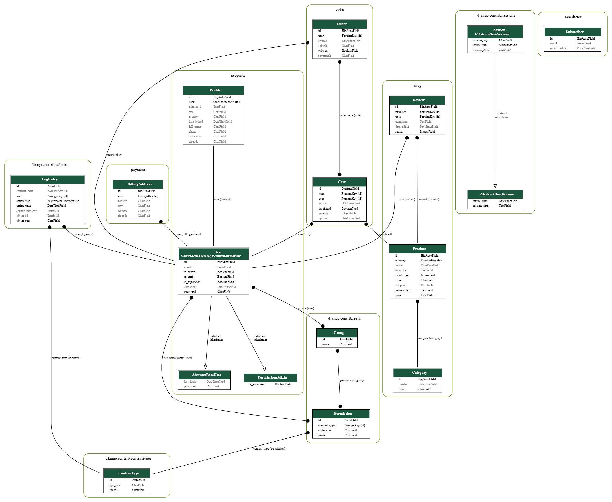

# Authentic Shop Online Store

Welcome to our Online Store project! This Full-Stack web application allows users to browse a variety of products, add them to their cart, and make purchases using the integrated Stripe payment system. 
Admin users can manage products, categories, and orders. 
The application also includes user authentication, a user profile, and a newsletter signup feature.

- [Link to Authentic Shop](https://chipotle.pythonanywhere.com/)

## Contents

- [Features](#features)
- [For-Users](#for-users)
    - [User-Authentication](#for-users)
    - [Product-Browsing](#for-users)
    - [Shopping-Cart](#for-users)
    - [Payment](#for-users)
    - [Order-Management](#for-users)
    - [Newsletter-signup](#for-users)
- [For-Admin](#for-admin)
    - [Admin-Dashboard](#for-admin)
- [Structure](#structure)
    - [Data-storage](#data-storage)
- [Development-Methodologies](#development-methodology)
- [SEO-And-Marketing](#seo-and-marketing)
- [Search-Engine-Optimisation](#search-engine-optimisation)
- [Digital-Marketing](#digital-marketing)
    - [Facebook](#facebook)
- [Technologies](#technologies-used)
- [Getting-started](#getting-started)
    - [Installation](#installation)
- [Learning-Outcomes-and-assesment-criterias](#learning-outcomes-and-assessment-criteria)
    - [Learning-Outcomes](#learning-outcomes)
    - [Assesment-Criterias](#assessment-criteria)
    - [Project-Checklist](#project-completion-checklist)
    - [Project-Structure](#project-structure)
- [Stripe](#stripe)
- [Performance](#performance)
- [Responsiveness](#responsive)
- [Validation](#validation)
- [Wireframes](#wireframe)
- [Testing](#testing)
- [User-stories](#user-stories)
- [Credits](#credits)    

## Features

### For Users:
- **User Authentication:**
  - Users can register, log in, and log out.
  - Profile page to view and edit personal information.

- **Product Browsing:**
  - Browse through a range of products with detailed descriptions.
  - View product categories and filter products by category.

- **Shopping Cart:**
  - Add products to the cart from the product details page.
  - View and edit cart items: increase, decrease quantity, or remove items.
  - Proceed to checkout for payment.

- **Payment:**
 - Integrated Stripe payment system for secure and easy payments.

- **Order Management:**
  - View detailed order history with order status.
  - Users can add reviews for purchased products from the order details page.

- **Newsletter Signup:**
  - Users can sign up for the newsletter to receive updates and promotions.

### For Admin:
- **Admin Dashboard:**
  - Add products through the frontend
  - Add categories through the frontend
  - View subscribers
  - View and take actions on product lists
  - Easily add products to a specific category
  - Easily add images by an upload option of a product
  - Easily add and edit descriptions of a product
  - Easily reduce the price of a product
  - Have an overview of our product list to keep track with different ID's
  - View and manage orders: Mark orders as fulfilled, and view order details.
  - Can manage users.
  - View user reviews and manage them.
  ### Structure
  ## Data storage
  The PostgreSQL database structure was meticulously defined and mapped out using a database schema, ensuring the necessary data interactions for developing a usable and robust product. The core of this schema is the Product model, which encapsulates the essential properties of an online business product.

  This comprehensive and interconnected schema not only supports the core functionalities of an e-commerce platform but also provides a scalable foundation for future enhancements.
  

  ### Development Methodology
  - **Agile Methodologies:** Agile practices were followed during the development process, with regular updates and feature additions in the GitHub repository.
  [Agile](https://github.com/users/Gomsur/projects/12/views/1)

  ### SEO and Marketing

  ## Search engine optimisation
  - A sitemap.xml file was created and added to the project root.
  - A robots.txt file was created and added to the project root.
  - Meta description tags have been added.

  ## Digital Marketing
  - **Facebook Business Page:** A real or mockup Facebook business page is utilized for digital marketing efforts.
  - **Newsletter Signup:** A newsletter signup form is available for users to subscribe to updates and promotions.

  ## Facebook
  - A Facebook site was created to market our brand on social media, this is crucial to reach our customers and keep them loyal.
  - [Authentic-Shop-Facebook](https://www.facebook.com/people/Authentic-shop/61558441835330/?mibextid=LQQJ4d)
    

  ## Technologies Used

  - **Frontend:**
  - HTML
  - CSS
  - JavaScript
  - Bootstrap v4.6

  - **Backend:**
  - Python 3.12
  - Django 5.0.3

  - **Database:**
  - Postgres

  - **Payment Integration:**
  - Stripe

  ## Getting Started

  ### Installation
1. Clone the repository:
   ```bash
   git clone https://github.com/your-username/online-store.git
   ```

2. Install dependencies:
   ```bash
   pip install -r requirements.txt
   ```

3. Set up the database:
   ```bash
   python manage.py migrate
   ```      

4. Create a superuser (admin):
   ```bash
   python manage.py createsuperuser
   ```

5. Start the development server:
   ```bash
   python manage.py runserver
   ```      

6. Access the admin panel at `http://127.0.0.1:8000/admin` to manage products and categories. 

## Learning Outcomes and Assessment Criteria

### Learning Outcomes
1. Integrate an e-commerce payment system and product structure in a cloud-hosted Full-Stack web application
2. Employ advanced User Experience Design to build a commercial-grade Full Stack Web Application
3. Employ Search Engine Optimisation (SEO) techniques to improve audience reach
4. Create a secure Full Stack Web application that incorporates Authentication and role-based Authorisation functionality
5. Employ marketing techniques to create brand reach
6. Understand the fundamentals of E-commerce applications

### Assessment Criteria
The project was developed with the following criteria in mind:
- **E-commerce Functionality:** Implemented using Django, with features such as shopping cart checkout, subscription payments, product reviews, etc.
- **User Experience Design:** Designed for accessibility, UX principles, and user interaction.
- **SEO Techniques:** Meta tags, sitemap, robots.txt, and SEO-friendly content.
- **Authentication & Authorization:** User registration, login, and role-based access control.
- **Marketing Strategies:** Facebook Business Page, newsletter signup form.

## Project Completion Checklist
- [x] Implemented at least 3 original custom models
- [x] Created forms for CRUD functionality
- [x] Designed UI elements for user interactions
- [x] Followed Agile methodologies in development
- [x] Included robots.txt and sitemap.xml files
- [x] Used descriptive meta tags for SEO
- [x] Implemented Facebook Business Page or mockup
- [x] Included newsletter signup form
- [x] Documented e-commerce business model and marketing strategies
- [x] Set DEBUG mode to False
- [x] Implemented user registration, login, and E-commerce functionality
- [x] Provided detailed testing write-ups

## Project Structure
The project follows a standard Django project structure with the following key components:
- `project/` (Main project directory)
  - `app/` (Main application directory)
    - `templates/` (HTML templates)
    - `static/` (Static files: CSS, JavaScript, images)
    - `models.py` (Django models)
    - `views.py` (Django views)
    - `urls.py` (URL patterns)
  - `config/` (Project settings and configurations)
  - `manage.py` (Django management script)

  ## Stripe
  - Stripe have been chosen as a payment solution.
  - [More info about Stripe testing](https://docs.stripe.com/testing)

  ## Performance
  - Performance were checked through [Pagespeed](https://pagespeed.web.dev/)
  - Performance: 84
  - Availability: 88
  - Best methods: 100
  - SEO: 90
  - You can see the full analyze [here](media/Products/page%20performance.png)
    

  ## Responsive
  - [Phone](media/Products/responsive%20phone.png)
  - [Tablet](media/Products/responsive%20tablet.png)
    
    

  ## Validation
  - Validation have been made successfully through jigsaw and Validator W3.
  - [HTML](media/Products/validation%20html.png)
  - [CSS](media/Products/validation%20css.png)
    
    

  ## Wireframe
When building the wireframe for our project, we have gone for a simple, clean scandinavian look of our site that would suit an ecommerce brand with a large product range and category page as we want the site to convert.
  - [Wireframe desktop](media/Products/Wireframe%20desktop.png)
  - [Wireframe phone](media/Products/Wireframe%20phone.png)
    
    

  ## Testing
  - Testing have been done both manually and dymanically, manually through projects in Github and were completed in three different stages, from first phase, to second to the last step that were completed.
  - Manual testing can be seen [here](https://github.com/users/Gomsur/projects/10)
  - Testing have also been done dymanically through a tests.py file.

  ## User Stories
  - User stories have been followed through projects in Github and where built manually, completed in three different stages.
  It can be viewed [here](https://github.com/users/Gomsur/projects/11/views/1)

  ## Credits
  - Stripe for payment
  - My dear friend John Dickson from CI class
  - Pixabay for images
  - Validator W3
  - Jigsaw
  - Browserstack
  - Pagespeed
